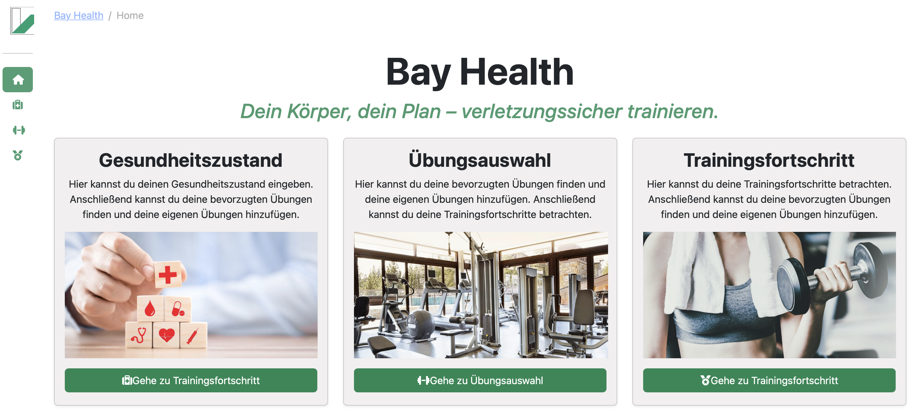
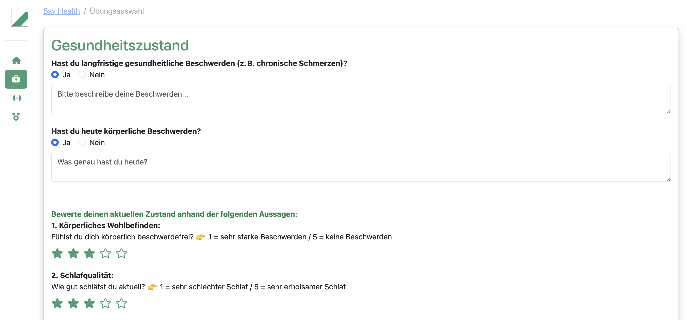
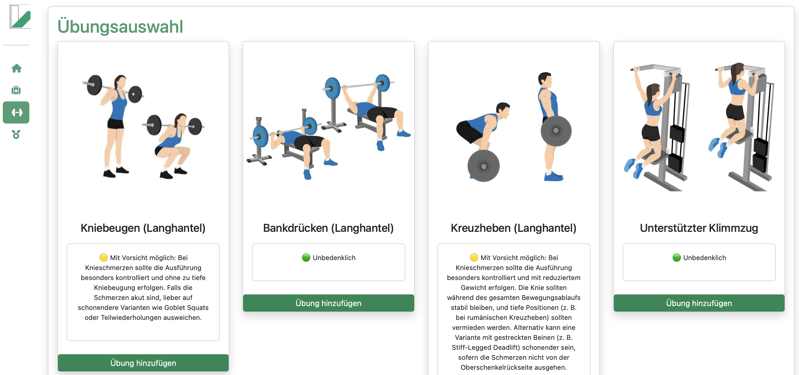
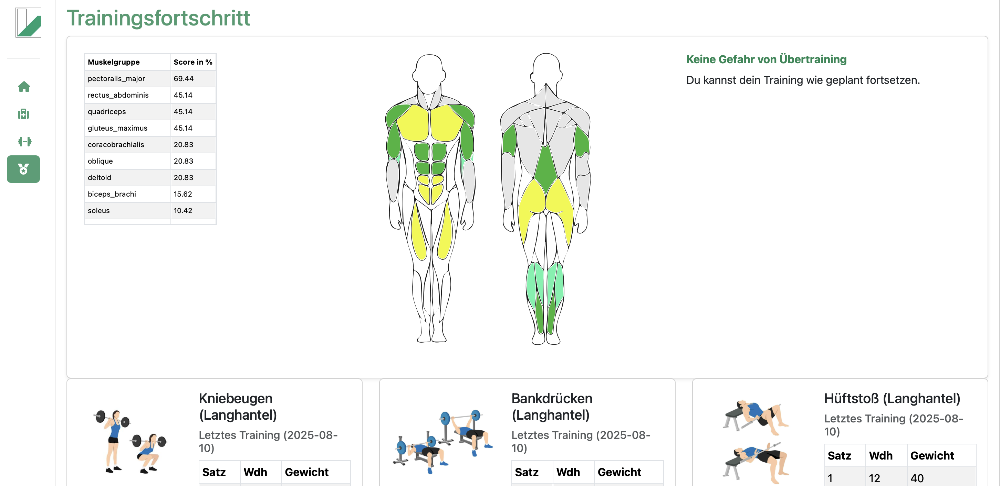
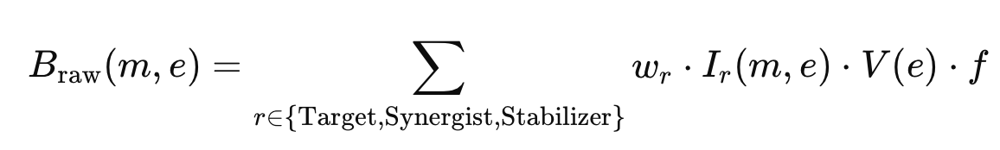

# BayHealth

BayHealth is an AI-powered training companion for healthy, sustainable strength training.  
The app combines **personalized exercise recommendations** from an LLM with a **rule-based muscle load analysis** to identify potential overtraining early and adapt exercises to the user's specific conditions.

---

## Goal & Motivation

Our core idea:  
Many strength athletes (especially beginners) underestimate risks such as **overtraining** and do not always optimally perform exercises in relation to existing complaints.  
BayHealth addresses this gap by:
- asking for the current health state,
- providing personalized exercise recommendations via an LLM,
- and analyzing and visualizing cumulative muscle load.

---

## Framework: Dash

BayHealth is built with **[Dash](https://dash.plotly.com/)** – a Python framework for interactive web applications based on **Flask**.  
Dash combines frontend (HTML, CSS, interactions) and backend (callback logic, data processing) in Python, enabling rapid development without a separate JavaScript frontend.

---

## Project Structure

```
.
├── assets/ 
├── data/muscle_use.csv 
├── pages/
│ └── home/
│ │ ├── layout.py
│ │ └── home.py
│ ├── health_state/
│ │ ├── layout.py
│ │ └── health_state.py
│ ├── exercises/
│ │ ├── layout.py
│ │ └── exercises.py
│ └── progress/
│ │ ├── layout.py
│ │ └── progress.py
├── app.py
├── app_layout.py
├── constants.py
├── utils.py
```

---

## Pages & Communication

### Home (`pages/home`)
- Serves as the entry point to the application.
- Presents three main navigation cards:
  1. **Health State** – Navigate to enter your current health status and recovery ratings.
  2. **Exercise Selection** – Browse available exercises and add them to your plan.
  3. **Training Progress** – View your cumulative muscle load and track performance.



### Health State (`pages/health_state`)
- Collects **long-term** and **current** complaints.
- Uses **star ratings** to record subjective recovery (Training Distress Scale).
- Stores all inputs in `dcc.Store(id="health_state")`.



### Exercises (`pages/exercises`)
- Displays available exercises (images + titles).
- Clicking an image → LLM evaluation based on stored complaints.
- Output: **traffic light logic** (🟢 / 🟡 / 🔴) + optional explanation.
- “Add Exercise” button stores selected exercises in `dcc.Store(id="added-exercises")`.
- Updates muscle SVG visualization based on **MUSCLE_MATRIX**.



### Progress (`pages/progress`)
- Reads `added-exercises` + `star-results` (recovery).
- Calculates muscle load (table + SVG heatmap).
- Provides warnings for overload and lists affected muscle groups.
- Offers input fields for logging new training sessions.



---

## Data Handling: `dcc.Store`

The app uses several `dcc.Store` components to store data **client-side** and share it between pages:

| Store-ID            | Content                                                     |
|---------------------|-------------------------------------------------------------|
| `health_state`      | Long-term/short-term complaints + star ratings              |
| `added-exercises`   | IDs of exercises selected by the user                       |
| `star-results`      | Star rating results for each recovery question              |
| `health-form-store` | (Optional, currently unused)                                |

**Advantage:** No need for reload or extra API calls when switching pages.  
**Storage type:** Default `memory` (lives in the browser runtime, resets on page reload).

---

## LLM Integration (Mistral API)

In the Exercises page, the Mistral API (`mistral-small-latest`) is called to evaluate whether an exercise is suitable for the user.

**Prompt logic:**
- Context: complaints (from `health_state`) + chosen exercise.
- Few-shot examples in the prompt → consistent traffic light ratings.
- Output format:
  - 🟢 No concerns
  - 🟡 Caution advised → short, concrete guidance.
  - 🔴 Not recommended → clear warning + reason.

**Example response:**
```
🟡 Caution advised: Avoid deep squats, as excessive bending can aggravate knee pain. Partial reps to 90° are recommended.
```

---

## Muscle Load Model

### 1. Data Basis
- `MUSCLE_MATRIX` from `constants.py` (based on exrx.net)
- Each exercise → weights for target muscles, synergists, stabilizers.

### 2. Calculation Steps

**Raw load:**




- $w_{\text{Target}} = 1.00$, $w_{\text{Synergist}} = 0.50$, $w_{\text{Stabilizer}} = 0.25$  
- $I_r(m, e) = 1$ if muscle $m$ is involved in role $r$ for exercise $e$  
- $V(e)$ = training volume (e.g., sets × reps) → in current version not implemented  
- $f$ = scaling factor applied to all muscle scores to normalize values into a meaningful range — results above 1.0 should indicate potential overtraining risk (currently 0.25).

**Cumulative load:**


**Modification by subjective recovery (star rating/TDS):**


In the current implementation:
```python
star_factor = 1 / (total_stars / 25)
```
with
- max_total_stars = 30
- If all ratings are 5 (fully recovered) → `star_factor = 0.83`  
- Lower ratings increase `star_factor`, representing higher perceived fatigue.


**Interpretation (traffic light):**
- < 10 % → 🟢 very low load  
- 10–40 % → 🟢 optimal range  
- 40–70 % → 🟡 elevated load  
- 70–100 % → 🟠 high load, approach with caution  
- 100–130 % → 🔴 overload risk  
- \> 130 % → 🔴 severe overload

### 3. Visualization
- SVG overlay (`muscle_sections.svg`) is dynamically colored.
- Color range from light green → dark red depending on load.
- Table + text summary complement the graphic.

---

## Start & Installation

**Requirements:**
- Python ≥ 3.12
- `.env` file with `MISTRAL_API_KEY`

**Install dependencies with Poetry:**
```bash
poetry install
```
Run in dev mode:
```
poetry run python app.py
```
→ App available at http://127.0.0.1:8050

Optional: Activate Poetry shells

```
poetry shell
python app.py
```

---

## ⚠️ Notes
Not a medical substitute: Recommendations serve as a reflection aid.
Inputs should be precise and honest for meaningful results.
LLM outputs can be inaccurate (hallucinations), so always critically review.